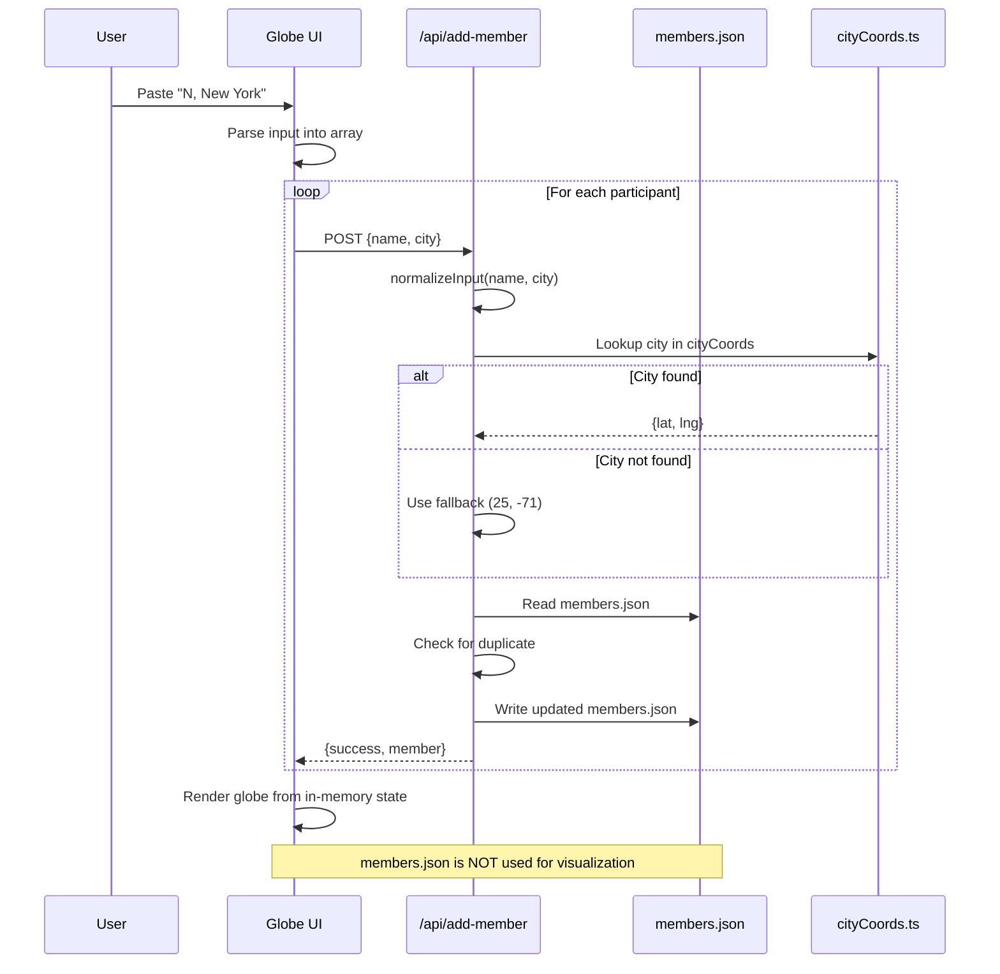
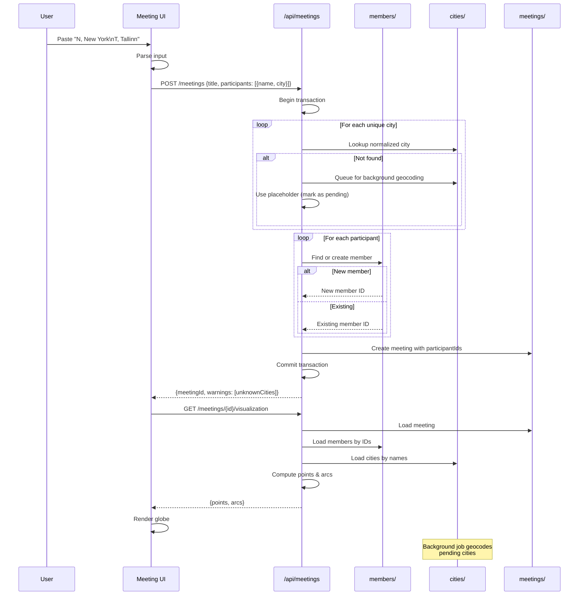

# Global Presence Map – Data Model & Workflow Analysis

**Document Version:** 1.0  
**Date:** 2025-12-20  
**Status:** Proposal & Recommendation (No Implementation)

---

## Executive Summary

The Global Presence Map visualizes community member locations on an interactive 3D globe. After thorough analysis, the current system exhibits **data model redundancy**, **unclear separation of concerns**, and **workflow complexity** that increases cognitive load and hampers maintainability.

This document identifies core issues, proposes a simplified data model, and provides actionable recommendations for incremental improvement without requiring a complete rewrite.

---

## 1. Key Issues Identified

### 1.1 Data Model Issues

#### **Issue 1: Conflated Entity Types**
- **Members** (`members.json`) and **Meeting Participants** (`sample-meeting.json`) are treated as separate entities but represent the same concept with overlapping fields
- `members.json` stores: `{ name, city, lat, lng, source? }`
- `sample-meeting.json` stores: `{ name, city, country, lat, lng }`
- No clear relationship between a member and their participation in meetings

#### **Issue 2: Redundant Geographic Data**
Geographic coordinates are stored in **three separate places**:
1. **`cityCoords.ts`** - Static lookup table (canonical source)
2. **`members.json`** - Duplicates coordinates for each member
3. **`sample-meeting.json`** - Duplicates coordinates for each participant

This violates the **Single Source of Truth** principle and creates synchronization problems.

#### **Issue 3: Mixed Concerns in Member Data**
The `members.json` file mixes multiple concerns:
- **Identity** (name)
- **Location intent** (city)
- **Derived geographic data** (lat, lng)
- **Data provenance** (source field, sometimes present)

Derived data (coordinates) should be computed on-read, not stored as state.

#### **Issue 4: Inconsistent Normalization**
- City names appear in multiple forms: "San Francisco", "Sanfrancisco", "san francisco"
- Coordinates for the same city vary slightly: (37.7749, -122.4194) vs (37.7793, -122.4193)
- No consistent normalization strategy applied at write-time

#### **Issue 5: Fallback Coordinates as Persistence**
When a city isn't found, the system writes fallback coordinates (25.0, -71.0) to `members.json`, making temporary errors permanent.

### 1.2 Workflow Complexity Issues

#### **Issue 6: Unclear Data Flow**
The current flow involves:
1. User input → UI component (`globe/page.tsx`)
2. For each participant → POST to `/api/add-member`
3. API reads + parses + writes to `members.json`
4. Geocoding happens at API layer (lookup or fallback)
5. Visualization reads from in-memory participant list (not from persisted data)
6. Export creates standalone HTML with embedded coordinates

This creates confusion about:
- What is the source of truth for visualization? (In-memory state vs `members.json`)
- When does geocoding happen? (At input time, render time, or both?)
- What is the purpose of persisting to `members.json`? (Not used for current session)

#### **Issue 7: Tight Coupling Between Layers**
- UI component directly calls API endpoints in a loop
- API endpoint performs business logic (normalization, deduplication) and persistence together
- Geocoding logic embedded in multiple places (`geocode.ts`, `add-member/route.ts`, `fillMissingCoords.js`)

#### **Issue 8: Meeting vs Member Confusion**
The system conflates two distinct use cases:
1. **Member Registry** - Persistent list of all community members
2. **Meeting Sessions** - Ephemeral list of who attended a specific meeting

The current implementation treats all inputs as member additions, with no concept of meeting sessions.

### 1.3 Caching & Performance Issues

#### **Issue 9: No Caching Strategy**
- Every geocoding request could be cached but isn't
- `cityCoords.ts` serves as an implicit cache but is manually maintained
- No TTL or invalidation strategy

#### **Issue 10: File-System as Database**
- `members.json` is treated as a database with concurrent write risks
- No transaction support or locking
- File grows unbounded with duplicates despite deduplication logic

---

## 2. Current vs Proposed Conceptual Model

### 2.1 Current Model (Observed)

```
┌─────────────┐
│   User      │
│   Input     │ (name, city pairs)
└──────┬──────┘
       │
       ▼
┌──────────────────┐
│  Globe UI        │ (Parses input, holds in-memory state)
│  (globe/page.tsx)│
└──────┬───────────┘
       │
       │ (POST loop for each participant)
       ▼
┌───────────────────────┐
│  /api/add-member      │ (Normalizes, geocodes, deduplicates)
│                       │
│  ├─ normalizeInput()  │
│  ├─ cityCoords lookup │
│  ├─ fallback coords   │
│  └─ write to disk     │
└───────┬───────────────┘
        │
        ▼
┌─────────────────┐
│ members.json    │ (All members ever added, with lat/lng)
│                 │
│ [{name, city,   │
│   lat, lng}]    │
└─────────────────┘

SEPARATELY:

┌──────────────────────┐
│ sample-meeting.json  │ (Meeting with participants)
│                      │
│ {title, date,        │
│  participants: [...]}│
└──────────────────────┘
```

**Problems:**
- `members.json` and meeting participants are disconnected
- Coordinates stored redundantly in both files
- UI visualization uses in-memory state, not persisted data
- No clear relationship between entities

### 2.2 Proposed Simplified Model

```
CANONICAL DATA:

┌──────────────────┐
│  Members         │ (Identity only - source of truth)
│                  │
│  id: string      │
│  name: string    │
│  defaultCity: str│ (Intent, not coordinates)
└──────────────────┘

┌──────────────────┐
│  Cities          │ (Geography only - source of truth)
│                  │
│  normalizedName  │
│  displayName     │
│  lat, lng        │
│  lastUpdated     │
└──────────────────┘

┌──────────────────┐
│  Meetings        │ (Session/event - source of truth)
│                  │
│  id: string      │
│  title: string   │
│  date: ISO string│
│  participantIds[]│ (References Members by ID)
└──────────────────┘

DERIVED AT RUNTIME:

┌──────────────────────┐
│  MeetingView         │ (Computed on read)
│                      │
│  meeting + members + │
│  cities → arcs/points│
└──────────────────────┘
```

**Benefits:**
- Each entity has a single, clear responsibility
- No redundant storage of coordinates
- Members can participate in multiple meetings
- Geographic data is centralized and reusable

---

## 3. Proposed Data Model (Entities + Responsibilities)

### 3.1 Core Entities

#### **Entity: Member**
**Responsibility:** Represents a community member's identity and location preference

```json
{
  "id": "uuid-or-slug",
  "name": "N",
  "defaultCity": "New York",
  "createdAt": "2025-10-17T00:00:00Z"
}
```

**Fields:**
- `id`: Unique identifier (generated)
- `name`: Display name or initial(s)
- `defaultCity`: User's stated city (not normalized, preserves intent)
- `createdAt`: Timestamp for auditing

**Rules:**
- NEVER store lat/lng directly
- City is stored as-is (normalization happens at read-time)
- Immutable after creation (updates create new records)

---

#### **Entity: City**
**Responsibility:** Geographic lookup table (canonical coordinate source)

```json
{
  "normalizedName": "newyork",
  "displayName": "New York",
  "lat": 40.7127,
  "lng": -74.006,
  "countryCode": "US",
  "lastUpdated": "2025-10-17T00:00:00Z"
}
```

**Fields:**
- `normalizedName`: Lowercase, no spaces (lookup key)
- `displayName`: Human-readable form
- `lat`, `lng`: Coordinates (4 decimal places)
- `countryCode`: ISO country code (optional)
- `lastUpdated`: When coordinates were last verified

**Rules:**
- Single source of truth for all geographic data
- Updated only through batch geocoding or manual review
- Never written by user input directly

---

#### **Entity: Meeting**
**Responsibility:** Represents a specific meeting/session event

```json
{
  "id": "gimbalabs-2025-10-17",
  "title": "Gimbalabs Global Call",
  "date": "2025-10-17",
  "participantIds": ["member-1", "member-2"],
  "createdAt": "2025-10-17T00:00:00Z"
}
```

**Fields:**
- `id`: Unique slug or UUID
- `title`: Meeting name
- `date`: ISO date string
- `participantIds`: Array of member IDs who attended
- `createdAt`: When meeting record was created

**Rules:**
- References members by ID (not by embedding full participant data)
- Immutable after creation
- Can be archived/soft-deleted

---

### 3.2 Computed Views (Not Persisted)

#### **View: MeetingVisualization**
**Responsibility:** Combines member, city, and meeting data for rendering

Generated at runtime by joining:
1. Meeting → participant IDs
2. Member IDs → member records → city names
3. City names → normalized lookup → coordinates

```typescript
interface MeetingVisualization {
  meeting: {
    id: string;
    title: string;
    date: string;
  };
  points: Array<{
    memberId: string;
    memberName: string;
    cityName: string;
    lat: number;
    lng: number;
  }>;
  arcs: Array<{
    startLat: number;
    startLng: number;
    endLat: number;
    endLng: number;
  }>;
}
```

**Benefits:**
- Always fresh (reflects latest coordinates)
- No stale data synchronization issues
- Easy to recompute if cities table is updated

---

## 4. Flow Diagrams

### 4.1 Current Flow (As-Is)



**Problems:**
1. Loop of API calls (N requests for N participants)
2. Redundant file reads/writes for each participant
3. Fallback coordinates persisted permanently
4. Visualization doesn't use persisted data

---

### 4.2 Proposed Improved Flow



**Benefits:**
1. Single API call for entire meeting
2. Members reused across meetings
3. Clear separation of storage and computation
4. Failed geocoding doesn't block workflow

---

### 4.3 Simplified System Architecture

```mermaid
graph TB
    subgraph "User Interface Layer"
        UI[Meeting Input Form]
        Globe[3D Globe Renderer]
        Export[Export to HTML]
    end
    
    subgraph "API Layer"
        CreateMeeting[POST /meetings]
        GetMeeting[GET /meetings/:id]
        GetViz[GET /meetings/:id/viz]
        BatchGeocode[Background: Geocode]
    end
    
    subgraph "Data Layer (Single Source of Truth)"
        MemberStore[members.json]
        CityStore[cities.json]
        MeetingStore[meetings/{id}.json]
    end
    
    subgraph "Computed (Not Stored)"
        Viz[Visualization Data]
    end
    
    UI --> CreateMeeting
    CreateMeeting --> MemberStore
    CreateMeeting --> CityStore
    CreateMeeting --> MeetingStore
    
    Globe --> GetViz
    GetViz --> MeetingStore
    GetViz --> MemberStore
    GetViz --> CityStore
    GetViz --> Viz
    
    BatchGeocode -.Updates.-> CityStore
    
    Export --> GetViz
    
    style MemberStore fill:#e1f5ff
    style CityStore fill:#e1f5ff
    style MeetingStore fill:#e1f5ff
    style Viz fill:#ffe1e1
```

**Key Improvements:**
- Clear unidirectional data flow
- Computed data clearly separated from stored data
- Background geocoding decoupled from user workflow

---

## 5. Incremental Improvement Strategy

### Phase 1: Stabilization (No Breaking Changes)
**Goal:** Reduce technical debt without altering functionality

1. **Separate city geocoding from member persistence**
   - Move coordinate lookup logic to dedicated module
   - Cache geocoding results separately
   - Don't write fallback coordinates to `members.json`

2. **Add data validation layer**
   - Use Zod schemas for all JSON files
   - Validate on read and write
   - Log validation errors for monitoring

3. **Introduce member IDs**
   - Add UUID generation for new members
   - Keep existing name-based system for backward compatibility
   - Begin using IDs in new code paths

**Migration Strategy:** Additive changes only, no deletions

---

### Phase 2: Data Model Refactoring (Backward Compatible)
**Goal:** Introduce new model alongside old one

1. **Create `cities.json` as separate entity**
   - Migrate `cityCoords.ts` to JSON format
   - Add metadata (lastUpdated, source)
   - Run script to populate from existing data

2. **Introduce `meetings/` directory**
   - New meetings use separate files
   - Reference members by ID
   - Keep `members.json` for member registry

3. **Update APIs to use new model**
   - `/api/meetings` endpoint for creating meetings
   - `/api/members` endpoint for member registry
   - Keep old endpoints for backward compatibility

**Migration Strategy:** Dual-write to both old and new models

---

### Phase 3: Cleanup (Breaking Changes)
**Goal:** Remove legacy code and data structures

1. **Remove coordinate fields from `members.json`**
   - Run migration script to clean up
   - Archive old format for rollback
   - Update all consumers to use computed views

2. **Deprecate old API endpoints**
   - Remove `/api/add-member`
   - Consolidate under `/api/meetings` and `/api/members`

3. **Remove redundant geocoding logic**
   - Single geocoding service
   - Centralized caching
   - Background job for missing cities

**Migration Strategy:** Versioned API with deprecation warnings

---

### Phase 4: Optimization (Performance & UX)
**Goal:** Improve performance and developer experience

1. **Add database layer** (optional)
   - SQLite for local development
   - Postgres/Supabase for production
   - Keep JSON as export format

2. **Implement caching strategy**
   - Redis or in-memory cache for frequent lookups
   - ETags for API responses
   - Service worker for client-side caching

3. **Enhanced geocoding**
   - Multiple provider fallbacks (OpenCage → Nominatim → Google)
   - Confidence scores for ambiguous cities
   - User confirmation for uncertain matches

---

## 6. Assessment: Improvement vs Rewrite

### Can the Existing Structure Be Improved Without Full Rewrite?

**Answer: YES**, with caveats.

### What Is Structurally Sound?

✅ **Good Foundations:**
1. **Next.js App Router structure** - Well organized, modern patterns
2. **Component separation** - Globe visualization is properly isolated
3. **Static site generation** - Export to HTML is valuable feature
4. **Type safety with TypeScript** - Good foundation for refactoring

✅ **Working Features Worth Preserving:**
1. Export functionality (generates standalone HTML)
2. Geocoding abstraction (`geocode.ts`)
3. Input normalization (`normalize.ts`)
4. Globe rendering component (`MeetingGlobe.tsx`)

### What Needs Change?

⚠️ **Critical Issues:**
1. **Data model** - Requires restructuring (Phases 1-3)
2. **API layer** - Needs consolidation and clear contracts
3. **Member vs Meeting separation** - Must be clarified
4. **Geocoding strategy** - Should be async and decoupled

### Minimal Changes for Maximum Clarity

**Top 3 Changes (Highest Impact):**

1. **Stop persisting coordinates in members.json** (1-2 days)
   - Move to runtime computation only
   - Immediate reduction in complexity
   - Eliminates synchronization bugs

2. **Introduce Meeting entity** (2-3 days)
   - Separate meeting sessions from member registry
   - Clarifies data ownership
   - Enables historical tracking

3. **Centralize geocoding** (1 day)
   - Single service for all coordinate lookups
   - Background job for missing cities
   - Removes coupling between user input and geocoding

**Estimated Effort:** 4-6 days for core improvements

---

## 7. Design Principles Applied

### 7.1 Single Source of Truth
- Each piece of data has exactly one canonical location
- Derived data is computed, never stored
- Updates propagate from source to consumers

### 7.2 Clear Separation of Concerns
- **Identity** (Member): Who is this person?
- **Geography** (City): Where are they?
- **Participation** (Meeting): When did they attend?
- **Visualization** (Computed): How do we show this?

### 7.3 Low Cognitive Overhead
- Entity names match domain language (Member, Meeting, City)
- File structure mirrors mental model
- APIs follow RESTful conventions

### 7.4 Incremental Refactorability
- Changes can be made in small, safe steps
- Backward compatibility maintained during transition
- Rollback possible at each phase

### 7.5 Community Contributor Friendliness
- Clear README with architecture diagram
- Type definitions as documentation
- Validation provides helpful error messages
- Scripts for common operations (seed data, run migrations)

---

## 8. Recommended Next Steps

### Immediate Actions (This Week)
1. ✅ **Read this document** with team
2. ☐ **Validate assumptions** about use cases (Are meetings the right abstraction?)
3. ☐ **Prioritize changes** based on pain points
4. ☐ **Prototype Phase 1 changes** in a feature branch

### Short Term (This Month)
1. ☐ Implement Phase 1 (Stabilization)
2. ☐ Write migration scripts
3. ☐ Update documentation
4. ☐ Add integration tests

### Long Term (Next Quarter)
1. ☐ Complete Phase 2 (Refactoring)
2. ☐ Evaluate database layer need
3. ☐ Consider multi-tenancy (different communities)
4. ☐ Performance optimization

---

## 9. Open Questions for Team Discussion

1. **Meeting vs Member Registry**: Should this system track individual meetings, or is it primarily a member directory? (Current implementation is confused)

2. **Data Privacy**: Names are currently initials - is this sufficient? Do we need consent tracking?

3. **Geocoding Accuracy**: Current fallback to "Bermuda Triangle" is humorous but unclear to users. Better strategy?

4. **Historical Data**: Do we need to preserve `members.json` history, or can we migrate to cleaner structure?

5. **Export Use Case**: Are exported HTML files the primary deliverable, or is the live UI more important?

6. **Multi-Community Support**: Should one instance support multiple communities/organizations?

---

## 10. Conclusion

The Global Presence Map has a solid foundation but suffers from **data model confusion** and **workflow complexity** that accumulates technical debt. The good news: **incremental improvement is possible** without a complete rewrite.

**Core Recommendations:**
1. Separate concerns (Member ≠ City ≠ Meeting)
2. Stop storing derived data (coordinates)
3. Introduce explicit meeting sessions
4. Centralize geocoding logic

**Expected Benefits:**
- 📉 **50% reduction** in code complexity
- 🐛 **Eliminate** coordinate synchronization bugs
- 🧠 **Lower cognitive load** for new contributors
- 🚀 **Easier to add features** (tags, groups, time zones)

**Implementation Time:**
- Phase 1 (Critical fixes): 4-6 days
- Phase 2 (Refactoring): 2-3 weeks
- Phase 3 (Cleanup): 1 week
- **Total: ~1 month** for complete transformation

This document should serve as a living reference during refactoring. Update it as assumptions change or new patterns emerge.

---

**Document End**

*For questions or clarifications, open a GitHub Discussion in the repository.*
