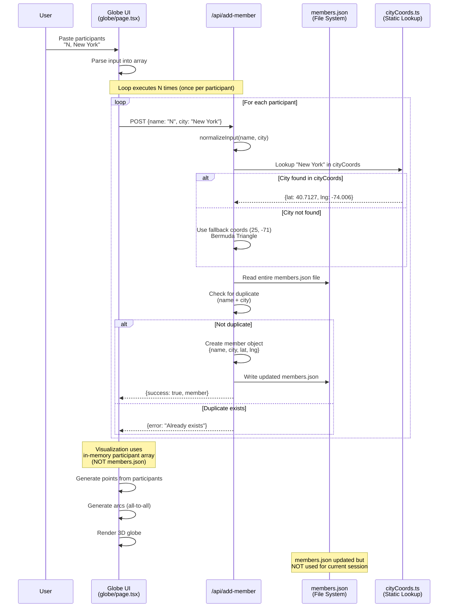
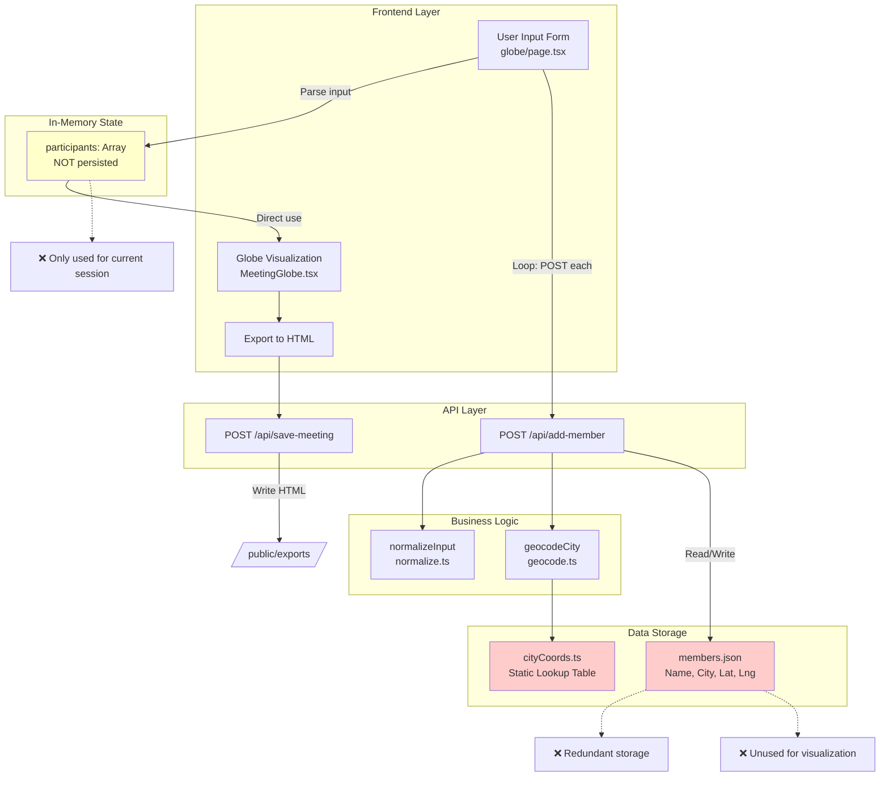
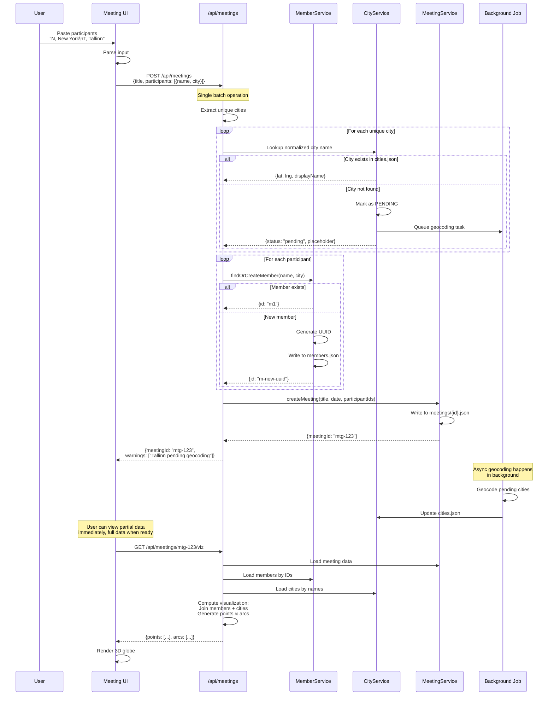
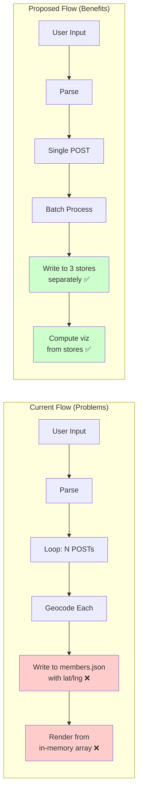
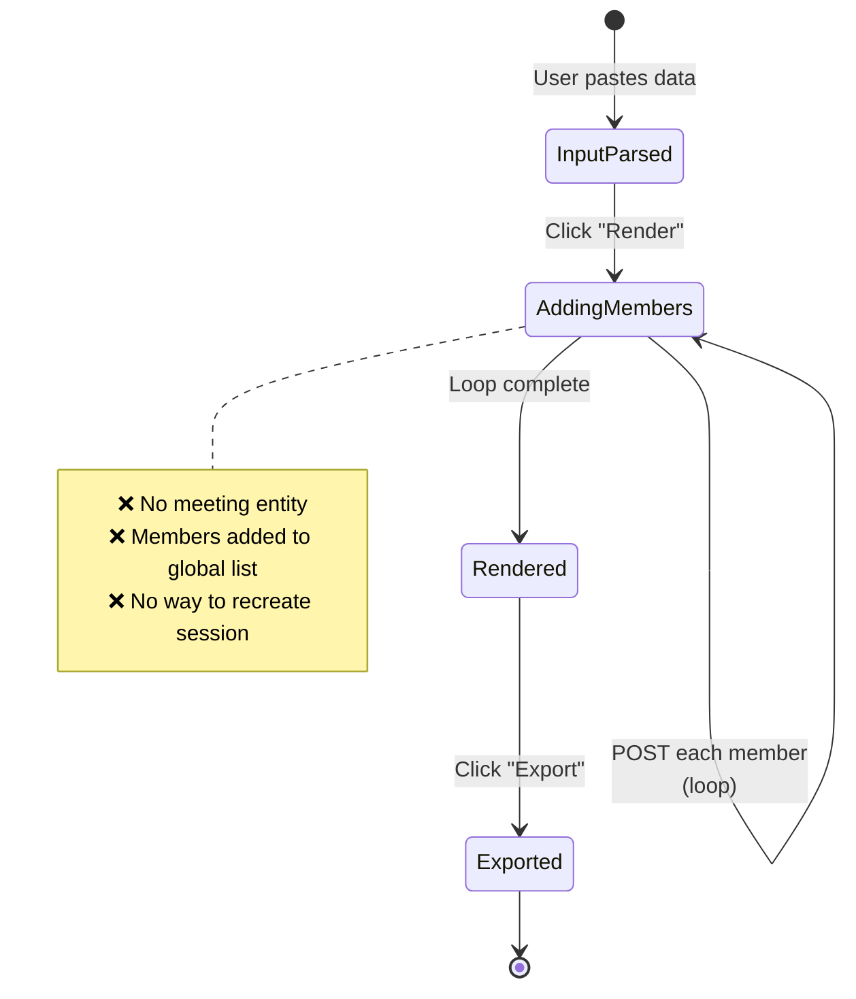
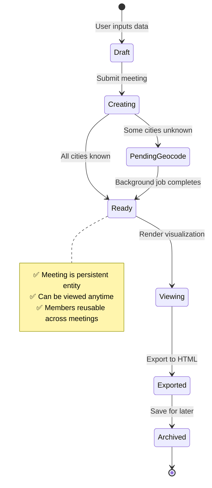
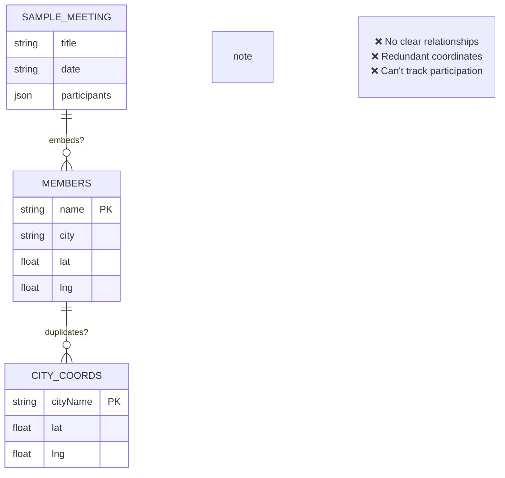
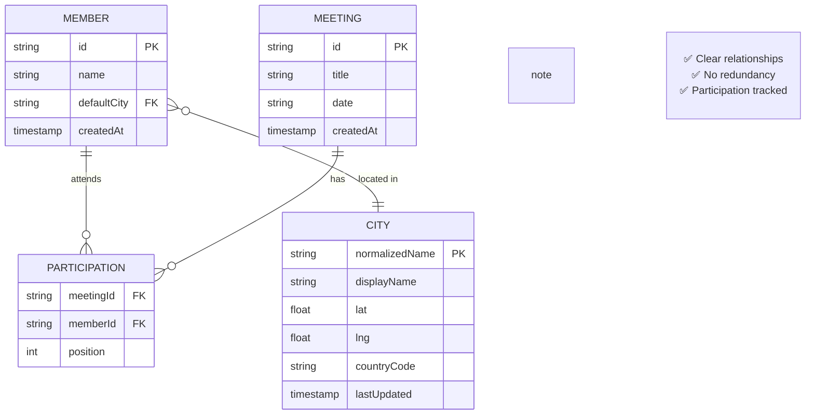
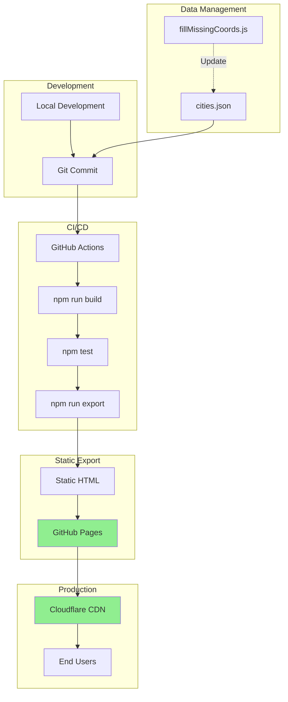
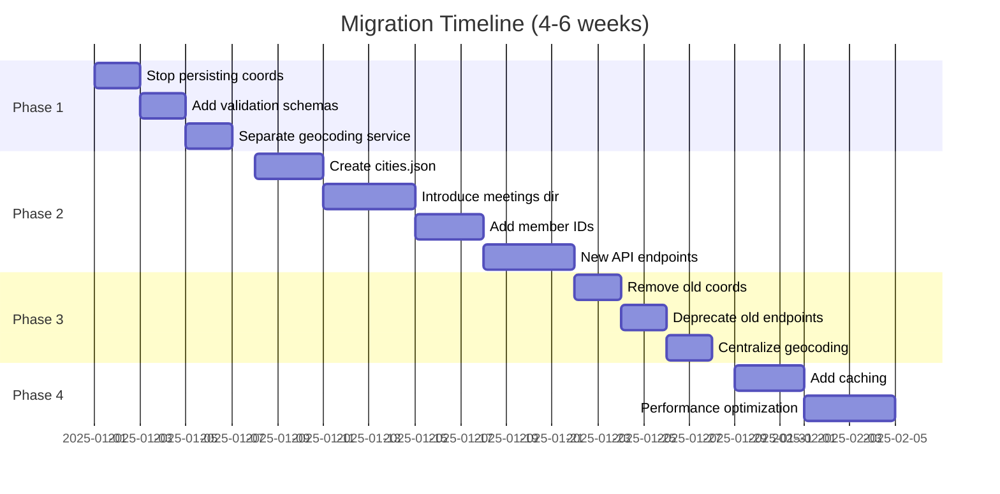

# Global Presence Map – Flow Diagrams

This document contains detailed Mermaid diagrams for visualizing the current and proposed system flows.

---

## 1. Current System Flow (As-Is)

### Sequence Diagram: User Input to Visualization



**Key Problems Highlighted:**
1. **N API calls in sequence** - Poor performance
2. **File read/write in loop** - Concurrency risk
3. **Fallback coords persisted** - Bad data becomes permanent
4. **Disconnected persistence** - Stored data not used

---

## 2. Current System Architecture

### Component Diagram: System Structure (Current)



**Architecture Issues:**
- Red boxes: Redundant coordinate storage
- Yellow box: Ephemeral state used for rendering
- Dotted lines: Problems

---

## 3. Proposed System Flow (To-Be)

### Sequence Diagram: Simplified Meeting Creation



**Key Improvements:**
1. **Single API call** - Better UX, better performance
2. **Background geocoding** - Non-blocking workflow
3. **Clear service separation** - Easier to test and maintain
4. **Computed visualization** - Always fresh, no stale data

---

## 4. Proposed System Architecture

### Component Diagram: System Structure (Proposed)

```mermaid
graph TB
    subgraph "User Interface"
        InputForm[Meeting Input Form]
        GlobeViz[Globe Visualization]
        ExportTool[Export to HTML]
    end
    
    subgraph "API Layer"
        CreateMeeting[POST /api/meetings]
        GetMeeting[GET /api/meetings/:id]
        GetViz[GET /api/meetings/:id/viz]
        GetMembers[GET /api/members]
    end
    
    subgraph "Service Layer"
        MemberSvc[MemberService<br/>CRUD operations]
        CitySvc[CityService<br/>Geocoding & lookup]
        MeetingSvc[MeetingService<br/>Meeting management]
        VizSvc[VisualizationService<br/>Compute points/arcs]
    end
    
    subgraph "Data Layer - Single Source of Truth"
        Members[members.json<br/>{id, name, defaultCity}]
        Cities[cities.json<br/>{name, lat, lng}]
        Meetings[meetings/{id}.json<br/>{id, title, participantIds}]
    end
    
    subgraph "Background Jobs"
        GeocodeBG[Geocode Service<br/>Async city resolution]
    end
    
    subgraph "Computed (Not Stored)"
        VizData[Visualization Data<br/>points, arcs]
    end
    
    InputForm --> CreateMeeting
    CreateMeeting --> MemberSvc
    CreateMeeting --> CitySvc
    CreateMeeting --> MeetingSvc
    
    MemberSvc --> Members
    CitySvc --> Cities
    MeetingSvc --> Meetings
    
    GlobeViz --> GetViz
    GetViz --> MeetingSvc
    GetViz --> MemberSvc
    GetViz --> CitySvc
    GetViz --> VizSvc
    
    VizSvc --> VizData
    VizData --> GlobeViz
    
    ExportTool --> GetViz
    
    CitySvc -.Queue.-> GeocodeBG
    GeocodeBG -.Update.-> Cities
    
    style Members fill:#e1f5ff
    style Cities fill:#e1f5ff
    style Meetings fill:#e1f5ff
    style VizData fill:#ffe1e1
    
    Note1[✅ Single source<br/>of truth]
    Note2[✅ Computed<br/>on-demand]
    Note3[✅ Background<br/>processing]
    
    Cities -.-> Note1
    VizData -.-> Note2
    GeocodeBG -.-> Note3
```

**Architecture Benefits:**
- Blue boxes: Canonical data stores (one responsibility each)
- Pink box: Computed data (never stored)
- Service layer provides clean abstractions
- Background jobs decouple slow operations

---

## 5. Data Flow Comparison

### Side-by-Side: Current vs Proposed



---

## 6. State Diagram: Meeting Lifecycle

### Current State Machine (Implicit)



### Proposed State Machine (Explicit)



---

## 7. Entity Relationship Diagram

### Current Model (Confused)



### Proposed Model (Clear)



---

## 8. Deployment Architecture

### Proposed Deployment Flow



---

## 9. Migration Path

### Phased Migration Strategy



---

**End of Diagrams Document**

*These diagrams are referenced in the main analysis document and can be viewed in any Markdown viewer that supports Mermaid syntax.*
